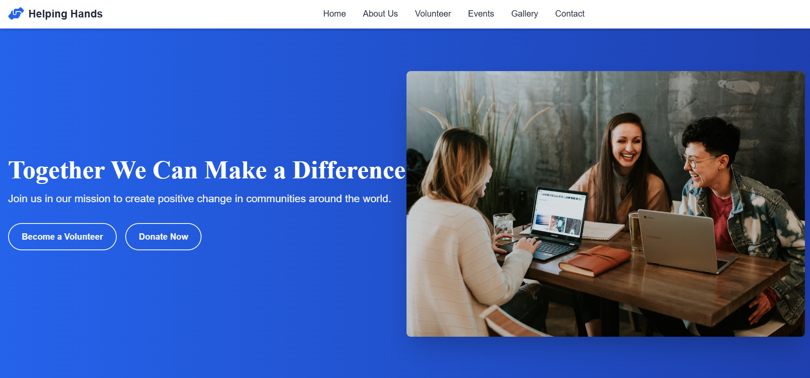

## 👐 Helping Hands NGO Website

## 🔍 Overview
Developed "Helping Hands" a responsive single-page website for an NGO using HTML5, CSS3, and JavaScript (ES6+). The site promotes the organization's mission, showcases impact, and facilitates volunteer engagement and donations. Integrated interactive features like a chatbot, volunteer search, and lightbox gallery. Utilized Tailwind CSS for styling, Swiper.js for testimonials carousel, and AOS for scroll animations. Implemented responsive design, custom cursor, and performance optimization. Managed version control with Git and collaborative development on GitHub.

## 📸 Screenshots

## ✨ Features
- ✅ Interactive AI Chatbot: Assists users with queries about volunteering, donations, programs, and contact details using predefined responses.
- 📋 Volunteer Search: Filters volunteers by skills or location with dynamic card rendering.
- 🔗 Donation Progress Bar: Animated progress bar showcasing fundraising goals (e.g., Clean Water Initiative).
- 🎨 Modern UI: Gradient backgrounds, custom cursor, and fade-in animations for an engaging experience.
- 📱 Responsive Design: Seamlessly adapts to mobile and desktop devices with Tailwind CSS.
- 🖼️ Lightbox Gallery: Displays project photos with full-screen view and smooth transitions.
- 🗓️ Events Timeline: Highlights past and upcoming events with status indicators.
- 🗺️ Google Maps Integration: Embedded map for the NGO’s headquarters.
- 📊 Animated Statistics: Counters for volunteers, people helped, countries, and projects with scroll-triggered animations.
- 📧 Volunteer Form: Validated form for volunteer applications with real-time feedback.

## 🧠 How It Works
- Chatbot Functionality: Responds to user queries with predefined answers, includes FAQ popup and donation prompts.
- Volunteer Search: Filters a predefined volunteer dataset by name, skills, or location, updating the UI dynamically.
- Donation Progress Bar: Animates to show fundraising progress (e.g., 75% of $10,000 goal) when in view.
- Lightbox Gallery: Displays images in a full-screen overlay with close functionality.
- Events Timeline: Shows events with status (Upcoming, Completed, Ongoing) and registration buttons.
- Smooth Scrolling: Navigation links and buttons scroll to sections with offset adjustments for mobile and desktop.
- Swiper.js Carousel: Rotates testimonials with pagination and autoplay.
- AOS Animations: Triggers fade and zoom animations on scroll for enhanced user engagement.

## 🛠️ Built With
- HTML5: Semantic structure for accessibility and SEO.
- CSS3: Custom styling with Tailwind CSS, gradient backgrounds, and custom scrollbar.
- JavaScript (ES6+): Core logic, DOM manipulation, and interactivity.
- Tailwind CSS: Utility-first framework for responsive design (tailwindcss.com).
- Swiper.js: Testimonials carousel (swiperjs.com).
- AOS Library: Scroll-triggered animations (michalsnik.github.io/aos/).
- Font Awesome: Icons for UI elements (fontawesome.com).
- Google Fonts: Inter and Merriweather fonts for typography (fonts.google.com).

## 🧰 Getting Started
To run Helping Hands locally:
1. Clone the Repository: git clone https://github.com/Poorna-Sai-Sriharsha/HelpingHands.git
2. Navigate to the Project Directory:cd HelpingHands
3. Open the Application: Launch `Helping Hands.html` in a browser or use a local server (e.g., `npx live-server`) for the best experience.
4. Note: No API key is required, as all data is static or uses embedded Google Maps. All libraries are included via CDNs.

## 🧪 Testing
- Tested for compatibility across Chrome, Firefox, Safari, and Edge.
- Verified responsive design on mobile (iOS, Android) and desktop devices.
- Validated form inputs and ensured smooth animations across screen sizes.

## 📖 What I Learned
- Mastered Tailwind CSS for rapid, responsive UI development.
- Implemented Swiper.js for carousel functionality and AOS for scroll animations.
- Enhanced skills in JavaScript DOM manipulation and event handling.
- Developed a custom chatbot with dynamic responses and typing indicators.
- Learned to integrate Google Maps and create interactive lightbox galleries.
- Improved error handling and form validation for user-friendly interactions.

## 🤝 Contributing
Contributions are welcome! Please fork the repository and submit a pull request with your changes. For major updates, open an issue first to discuss your ideas.

## 📝 Notes
- The website uses static data for volunteers, events, and testimonials. For a production environment, integrate a backend API for dynamic content.
- The chatbot uses predefined responses; consider integrating a natural language processing API for advanced functionality.
- Ensure images and external links are updated for production to avoid broken references.
